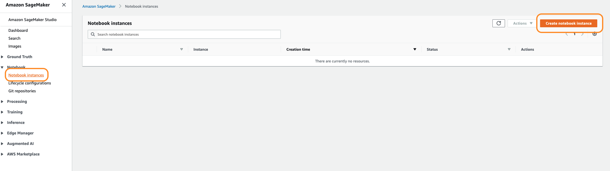
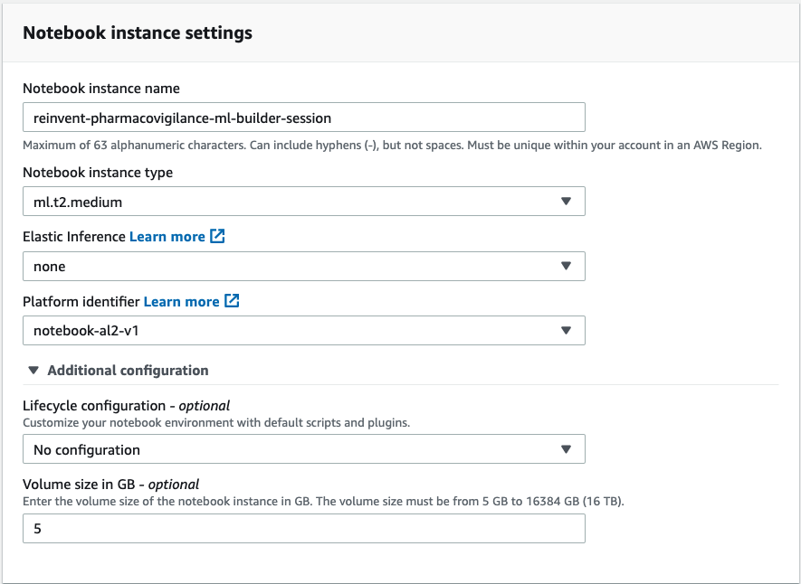
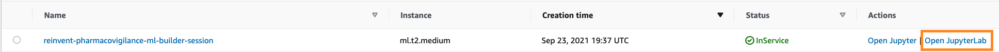

# Identify paraphrased text with HuggingFace on SageMaker

Many customers today deal with use cases where identifying paraphrased text has business value. For example, by identifying sentence paraphrases, a text summarization system could remove redundant information. Another application is to identify plagiarized documents. In this blog post, we will fine-tune a Hugging Face transformer on SageMaker to identify paraphrased sentence pairs in a few, simple steps.

Now, a truly robust model would be able to identify paraphrased text when the language used may be completely different, and also identify differences when the language used has high lexical overlap. Here, we’ll focus on the latter aspect. Specifically, we will look at whether we can train a model that can identify the difference between two sentences that have high lexical overlap and very different or opposite meanings. For example, the sentences below have the exact same words but opposite meanings: 

* I took a flight from New York to Paris
* I took a flight from Paris to New York

# Repository Structure
`sts-bert-huggingface-demo.ipynb`: Jupyter notebook walking through the demo  
`scripts/train.py`: Model training script  
`img`: Images for the notebook

# Instrutions 

## 1. Launching the Notebook Instance

1. In the upper-right corner of the AWS Management Console, confirm that you are in the AWS region of your choice.

2. Select Amazon SageMaker from the list of services. This will bring you to the Amazon SageMaker console homepage.

3. To create a new notebook instance, go to Notebook instances, and click the Create notebook instance button at the top-right of the browser window.

4.  Provide a Notebook instance name and select the `ml.t2.medium` instance for the Notebook instance type. 
For Platform identifier, select `notebook-al2-v1` to select the latest version of Amazon Linux 2. For more information on instance types, refer to the [SageMaker instance pricing documentation](https://aws.amazon.com/sagemaker/pricing/)

5. Under Permissions and encryption, for IAM role, select Create a new role. In the pop-up window, select Any S3 bucket and create the IAM role

6. Click Create notebook instance. This will take several minutes to complete.

## 2. Accessing the Notebook Instance

1. Wait for the notebook instance status to change from Pending to InService. This will take a few minutes.

2. Click Open JupyterLab, which will launch the JupyterLab homepage for your notebook instance.

## 3. Download the content for this session

1. In the top-left corner of the JupyterLab environment, select File, then New, then Terminal, to launch a new terminal within the JupyterLab environment. 
    

2. We will use this terminal to download the content for this session from github, using the git client. Inside the terminal window, type the following commands:

   $ `cd SageMaker/`
   
   $ `git clone https://github.com/aws-samples/identify-paraphrased-text-with-huggingface-on-amazon-sagemaker`
    
3. Switch back to the Jupyter notebook home tab, you will see the content of this GitHub Repo

4. Launch the notebook titled `sts-bert-huggingface-demo.ipynb` and select the `conda_pytorch_p37` kernel.

## Security

See [CONTRIBUTING](CONTRIBUTING.md#security-issue-notifications) for more information.

## License

This library is licensed under the MIT-0 License. See the LICENSE file.
